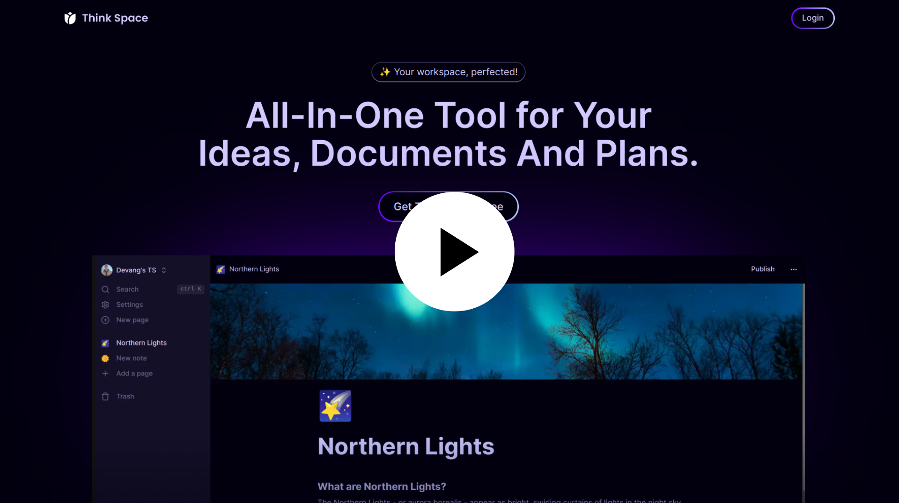

<p align="center">
     <a href="https://think-space-xi.vercel.app/" target="_blank">
        <picture>
            <source srcset="./public/images/readme-logo-dark.png" media="(prefers-color-scheme: dark)">
             
        </picture>
     </a>
  
</p>

<h4 align="center">Welcome to Think Space! An all-in-one tool for your ideas, documents and plans.</h4>

## About

Think Space is an all-in-one productivity application that streamlines note-taking, document creation, management, and publication. With a Notion-like text editor, advanced formatting, and real-time collaboration, Think Space enhances user productivity and experience.

## Demo

Click on the banner down below to check out the demo of FilmFuse.

<p align="center">
  <a href="https://drive.google.com/file/d/1zTF6XgsQXtHut-vwwJArmTLgSH7P-Jdn/view?usp=sharing" target="_blank">
    
  </a>
</p>

## Features

- **Notion-like Text Editor**: Advanced formatting and editing capabilities with a command prompt to create a block-based editor.
- **Real-time Collaboration**: Leveraging Convex for instantaneous reflection of changes across the platform.
- **Social Sign-ins**: Integration with Clerk for social sign-ins.
- **Themes**: Light and dark mode themes.
- **Publishing Options**: Options to publish notes and documents.
- **Keyboard Shortcuts**: Enabled search and other functionalities with keyboard shortcuts.
- **Responsive Design**: Functional and responsive design across devices.

## Technologies Used

- **NextJS**: A React framework for building server-side rendered applications.
- **Convex**: Real-time data synchronization for responsive applications.
- **Clerk**: Authentication and user management with social sign-ins.
- **TailwindCSS**: Utility-first CSS framework.
- **ShadCN**: A component library built on TailwindCSS.
- **Zustand**: A small, fast, and scalable state-management solution.
- **TypeScript**: A superset of JavaScript that adds static types.
- **Vercel**: A cloud platform for static sites and Serverless Functions.

## Installation

Follow these steps to set up the project locally:

1. **Clone the repository**:

   ```sh
   git clone https://github.com/thedevangvishnu/think-space.git
   cd think-space
   ```

2. **Install dependencies**:
   Make sure you have [Node.js](https://nodejs.org/) installed. Then, run:

   ```sh
   npm install
   ```

3. **Set up environment variables**:
   Create a `.env.local` file in the root directory and add the following variables:

   ```sh
   CONVEX_DEPLOYMENT=your_convex_deployment_id
   NEXT_PUBLIC_CONVEX_URL=https://your_convex_url
   NEXT_PUBLIC_CLERK_PUBLISHABLE_KEY=your_clerk_publishable_key
   CLERK_SECRET_KEY=your_clerk_secret_key
   EDGE_STORE_ACCESS_KEY=your_edge_store_access_key
   EDGE_STORE_SECRET_KEY=your_edge_store_secret_key
   ```

4. **Setup Convex**:

   - Visit [Convex](https://convex.dev/) and sign up or log in.
   - Create a new deployment and note the deployment ID.
   - Get the URL for your Convex instance.
   - Add these details to the `.env.local` file under `CONVEX_DEPLOYMENT` and `NEXT_PUBLIC_CONVEX_URL`.

5. **Setup Clerk**:

   - Visit [Clerk](https://clerk.dev/) and sign up or log in.
   - Create a new Clerk application.
   - Obtain the publishable key and secret key from the Clerk dashboard.
   - Add these keys to the `.env.local` file under `NEXT_PUBLIC_CLERK_PUBLISHABLE_KEY` and `CLERK_SECRET_KEY`.

6. **Setup Edge Store**:

   - If you are using an edge store (like AWS S3 or another service), make sure you have your access key and secret key.
   - Add these keys to the `.env.local` file under `EDGE_STORE_ACCESS_KEY` and `EDGE_STORE_SECRET_KEY`.

7. **Run the application**:

   - In one terminal, run the following command:

   ```sh
   npm run dev
   ```

   - Open another terminal and run the following command to run the convex server:

   ```sh
   npx convex dev
   ```

8. Open [http://localhost:3000](http://localhost:3000) to view it in the browser.

## Acknowledgements

- Special thanks to [Convex](https://convex.dev/), [Clerk](https://clerk.dev/), and other technology providers.
- Thanks to the contributors and the open-source community.
